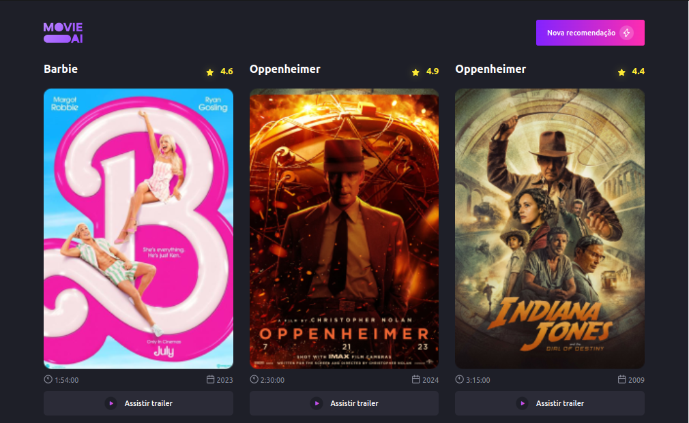

# Aplicação de Listagem de Filmes

## Visão Geral

Esta é uma aplicação web para listar e visualizar informações sobre filmes.

## Tecnologias Utilizadas

- **React**: Uma biblioteca JavaScript para construir interfaces de usuário.
- **Tailwind CSS**: Um framework de CSS utilitário para criar rapidamente designs personalizados.
- **Lucide React**: Um conjunto de ícones SVG React para uso em projetos web.

## Funcionalidades

1. **Listagem de Filmes**: Os filmes são exibidos em uma interface de lista, com cartões contendo informações básicas sobre cada filme, como título, imagem de capa e classificação.

2. **Responsividade**: A aplicação é responsiva e se adapta a diferentes tamanhos de tela, proporcionando uma experiência consistente em dispositivos móveis e desktops.

## Conclusão

Esta aplicação de listagem de filmes combina o poder do React com a praticidade do Tailwind CSS para fornecer uma experiência de usuário elegante e responsiva. Os ícones fornecidos pelo Lucide React adicionam um toque visual adicional, tornando a aplicação mais atraente e fácil de usar.

